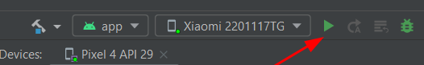
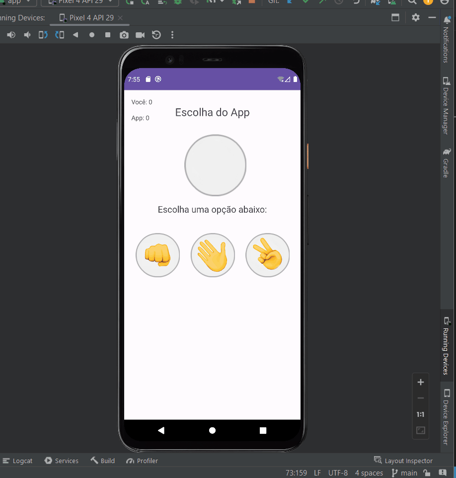

# 🚀 Pedra Papel Tesoura 
Projeto de estudos usando Java/Kotlin

# Como Rodar?

## Passo 01 - Clonar o projeto

- Clone esse repositório via HTTP:

```
git clone https://github.com/andreyna1808/pedra-papel-tesoura.git
```
- Clone esse repositório via SSH:

```
git clone git@github.com:andreyna1808/pedra-papel-tesoura.git
```

**OBS.:** Clone o projeto em um local sem caracteres especiais, espaçamentos ou coisas semelhantes, pode atrapalhar na hora de localizar o arquivo para rodar.

## Passo 02 - Abrir o Projeto

- Abra o Projeto em uma IDE, recomendo Android Studio

## Passo 03 - Rodar o Projeto

- Espera a IDE buildar o projeto e então rode ele apertando no play



# 🚀 Exemplo do app desenvolvido


# 📚 Sobre o Projeto
- Projeto básico para estudos, desenvolvido em Java com objetivo de focar em Kotlin para desenvolvimento de Apps

[](https://skillicons.dev)

[<br><sub>Andreyna Carvalho</sub>](https://github.com/andreyna1808)

## Email para contato: andreyna.m.carvalho@gmail.com